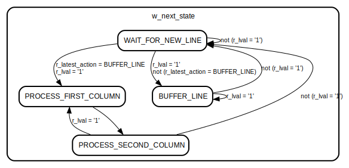

# Entity: RAW2RGB 
- **File**: RAW2RGB.vhd

## Diagram

## Generics

| Generic name         | Type                 | Value   | Description                                                                                                                                                                                        |
| -------------------- | -------------------- | ------- | -------------------------------------------------------------------------------------------------------------------------------------------------------------------------------------------------- |
| G_INPUT_COLOR_WIDTH  | natural              | 12      | bits per color. FIFO (line_buffer) needs to get regenerated if this changes!                                                                                                                       |
| G_RESULT_COLOR_WIDTH | natural              | 8       | width of each **color** in an output pixel                                                                                                                                                         |
| G_MODE               | integer range 0 to 3 | 0       | Sets the direction of the colors output by the camera  0: G1 - R | B - G2 (No mirroring)  1: R - G1 | G2 - B (Col mirroring)  2: B - G2 | G1 - R (Row mirroring)  3: G2 - B | R - G1 (Mirror both) |
| G_COLOR_BW           | string               | "COLOR" | Decides if the output is colored or black and white.   "COLOR" for colored output, "GRAY" for black and white.                                                                                     |

## Ports

| Port name                    | Direction | Type                                                      | Description                                                    |
| ---------------------------- | --------- | --------------------------------------------------------- | -------------------------------------------------------------- |
| I_CLOCK                      | in        | std_logic                                                 |                                                                |
| I_RESET_N                    | in        | std_logic                                                 | Low-Active reset                                               |
| I_PIXEL_RAW                  | in        | std_logic_vector(G_INPUT_COLOR_WIDTH - 1 downto 0)        | input for currently active raw pixel                           |
| I_LVAL                       | in        | std_logic                                                 | Linevalid - indicates if we are in the active range of the row |
| O_PIXEL_PROCESSED_FULL_WIDTH | out       | std_logic_vector((3 * G_INPUT_COLOR_WIDTH) - 1 downto 0)  | output for calculated pixel                                    |
| O_PIXEL_PROCESSED_DOWNSIZED  | out       | std_logic_vector((3 * G_RESULT_COLOR_WIDTH) - 1 downto 0) | output for calculated pixel with reduced width                 |
| O_PIXEL_OUT_VALID            | out       | std_logic                                                 | indicates if the output contains a valid pixel                 |

## Signals

| Name                         | Type                                                      | Description |
| ---------------------------- | --------------------------------------------------------- | ----------- |
| w_line_buffer_data           | std_logic_vector(G_INPUT_COLOR_WIDTH - 1 downto 0)        |             |
| w_line_buffer_q              | std_logic_vector(G_INPUT_COLOR_WIDTH - 1 downto 0)        |             |
| w_line_buffer_read_request   | std_logic                                                 |             |
| w_line_buffer_write_request  | std_logic                                                 |             |
| w_line_buffer_empty          | std_logic                                                 |             |
| w_line_buffer_full           | std_logic                                                 |             |
| w_line_buffer_usedw          | std_logic_vector(G_INPUT_COLOR_WIDTH - 1 downto 0)        |             |
| w_line_buffer_q_unsigned     | std_logic_vector(G_INPUT_COLOR_WIDTH - 1 downto 0)        |             |
| w_line_buffer_aclr           | std_logic                                                 |             |
| w_line_buffer_sclr           | std_logic                                                 |             |
| w_next_state                 | t_states                                                  |             |
| r_current_state              | t_states                                                  |             |
| w_latest_action              | t_actions                                                 |             |
| r_latest_action              | t_actions                                                 |             |
| w_buffer_2                   | std_logic_vector(G_INPUT_COLOR_WIDTH - 1 downto 0)        |             |
| w_buffer_1                   | std_logic_vector(G_INPUT_COLOR_WIDTH - 1 downto 0)        |             |
| r_buffer_2                   | std_logic_vector(G_INPUT_COLOR_WIDTH - 1 downto 0)        |             |
| r_buffer_1                   | std_logic_vector(G_INPUT_COLOR_WIDTH - 1 downto 0)        |             |
| r_lval_low_capture           | std_logic                                                 |             |
| r_capture_input_pixel_low    | std_logic_vector(G_INPUT_COLOR_WIDTH - 1 downto 0)        |             |
| r_current_input_pixel_delay  | std_logic_vector(G_INPUT_COLOR_WIDTH - 1 downto 0)        |             |
| r_current_input_pixel        | std_logic_vector(G_INPUT_COLOR_WIDTH - 1 downto 0)        |             |
| r_lval                       | std_logic                                                 |             |
| w_pixel_processed_full_width | std_logic_vector((3 * G_INPUT_COLOR_WIDTH) - 1 downto 0)  |             |
| w_pixel_processed_downsized  | std_logic_vector((3 * G_RESULT_COLOR_WIDTH) - 1 downto 0) |             |
| w_pixel_out_valid            | std_logic                                                 |             |
| r_pixel_processed_full_width | std_logic_vector((3 * G_INPUT_COLOR_WIDTH) - 1 downto 0)  |             |
| r_pixel_processed_downsized  | std_logic_vector((3 * G_RESULT_COLOR_WIDTH) - 1 downto 0) |             |
| r_pixel_out_valid            | std_logic                                                 |             |
| w_buffer_reset               | std_logic                                                 |             |

## Constants

| Name                  | Type    | Value                                      | Description |
| --------------------- | ------- | ------------------------------------------ | ----------- |
| c_right_output_border | integer | G_INPUT_COLOR_WIDTH - G_RESULT_COLOR_WIDTH |             |

## Types

| Name      | Type                                                                                                                                                                                      | Description |
| --------- | ----------------------------------------------------------------------------------------------------------------------------------------------------------------------------------------- | ----------- |
| t_states  | (WAIT_FOR_NEW_LINE,  BUFFER_LINE,  PROCESS_FIRST_COLUMN,  PROCESS_SECOND_COLUMN) |             |
| t_actions | (BUFFER_LINE,  PROCESS_PIXEL)                                                                                                                          |             |

## Processes
- RAW2RGB: ( r_current_state, r_lval, r_current_input_pixel, w_line_buffer_q, r_latest_action, r_buffer_2, r_buffer_1 )
- PROC_STATE_FF: ( I_CLOCK, I_RESET_N )
- PROC_INPUT_FF: ( I_RESET_N, I_CLOCK )
- PROC_COLOR_REGISTERS: ( I_RESET_N, I_CLOCK )
- PROC_OUTPUT_REGISTERS: ( I_RESET_N, I_CLOCK )
- PROC_VALID_FF: ( I_RESET_N, I_CLOCK )
- PROC_LATEST_ACTION_FF: ( I_RESET_N, I_CLOCK )

## Instantiations

- U0: LINE_BUFFER

## State machines

